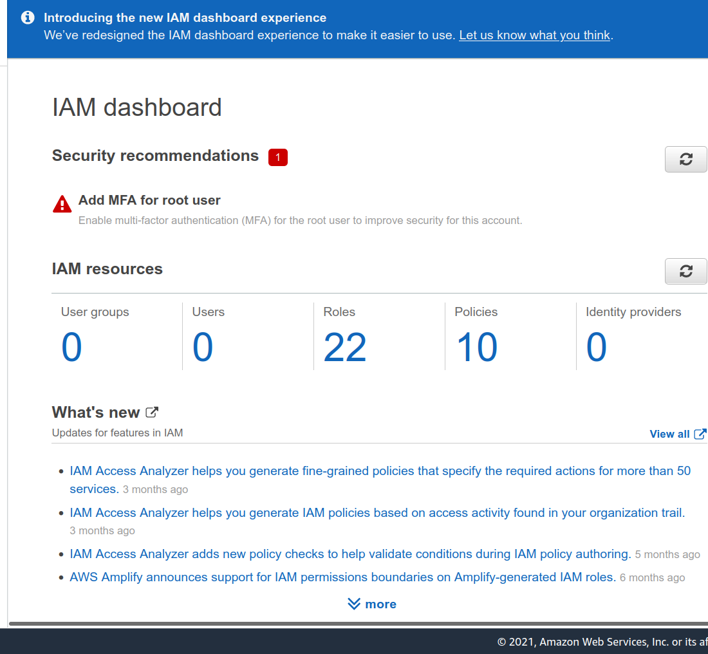

# Operationalizing Machine Learning on SageMaker 

## Initial Setup
I chose the smallest SageMaker instance available for my notebook, `ml.t2.medium` (Figure: Sage Maker Instance), because I'll be leaving it open for hours while I go through the project and don't need a very powerful instance in terms of CPU or RAM. 


Additionally, I picked `ml.m5.2xlarge` for both tuning and training since it has higher processing power, allowing the tuning and training processes to be done faster and avoiding memory concerns I faced with this dataset in a prior project.
To speed up tuning and ensure that better hyperparameters were chosen, I raised `max_jobs` to 12 for tuning, `max_parallel_jobs` to 3, and `early_stopping` type to "Auto."  
I made the following adjustments to the `hpo.py` file to enable distributed training, including changes to the settings required to begin the training (changing the number of instances to 4 and utilizing the gloo back end): 
https://github.com/aws/amazon-sagemaker-examples/blob/master/sagemaker
python-sdk/pytorch_mnist/mnist.py 
I discovered that I needed to update pandas since I was getting problems otherwise.
* Single instance trained endpoint: pytorch-inference-2021-11-28-16-08-01- 
790 
* Multi instance trained endpoint: pytorch-inference-2021-11-28-17-26-20-083 


## EC2 Training
I utilized the `t3.xlarge` instance and the `Deep Learning AMI (Amazon Linux 2) Version 54.0.` This seemed to me to be a nice balance of performance and affordability. Because there are two end points running while performing EC2 training, it makes logical to use a more powerful instance type than is required.
Similarly, because we don't know how long it'll take to set up and debug this EC2 training part, it's better to go with a smaller instance so we don't have to pay for a large instance while we're doing setup, debugging, and so on.
As you can see from my screenshot, I've limited access to my EC2 instance to only my IP address in order to prevent the risk of it being accessed unlawfully.


### Differences between ec2train1.py (EC2 script) and train_and_deploy-solution.ipynb+hpo.py (SageMaker scripts)
The key difference is that ec2train1.py lacks the main function, as well as the functionality to handle argument parsing and optional main running. Similarly, as I implemented in my modified hpo.py, ec2train1.py does not enable multi-instance learning. The most significant difference is that the ec2train1.py script trains using test data, which means it utilizes a lot smaller dataset and the same data for training and testing.
This has been changed : 
```python
train_data = torchvision.datasets.ImageFolder(root=test_data_path, transform=train_transform)
```
to
```
train_data = torchvision.datasets.ImageFolder(root=train_data_path, transform=train_transform)
```
to obtain a more thorough understanding of the EC2 instance The two spikes in CPU use on the `EC2 Training Resource` Use picture indicate that this took longer to run.
 


## Lambda functions
Because I had two endpoints, I generated two lambda functions. `TestEndpoint1Trainer` is used to test a single instance taught endpoint, whereas `testEndpointMTrainer` is used to test a multiple instance trained endpoint.
The handler code appears to need access to the SageMaker runtime, and it's laid up a little strangely, with code executing outside of the lambda handler function. Some older code is clearly commented out. Otherwise, the code is constructed to use the supplied parameter to call the endpoint. It appears that now would be a good moment to verify the input in order to lessen the burden on the endpoint and maybe avoid DOS assaults.
I got the following result from a test before providing full access to SageMaker to the role associated to the lambda functions:
```json
{
  "errorMessage": "An error occurred (AccessDeniedException) when calling the InvokeEndpoint operation: User: arn:aws:sts::933869125920:assumed-role/testEndpointMTrainer-role-pr3dpwbk/testEndpointMTrainer is not authorized to perform: sagemaker:InvokeEndpoint on resource: arn:aws:sagemaker:us-east-1:933869125920:endpoint/pytorch-inference-2021-11-28-17-26-20-083 because no identity-based policy allows the sagemaker:InvokeEndpoint action",
  "errorType": "ClientError",
  "stackTrace": [
    "  File \"/var/task/lambda_function.py\", line 24, in lambda_handler\n    response=runtime.invoke_endpoint(EndpointName=endpoint_Name,\n",
    "  File \"/var/runtime/botocore/client.py\", line 386, in _api_call\n    return self._make_api_call(operation_name, kwargs)\n",
    "  File \"/var/runtime/botocore/client.py\", line 705, in _make_api_call\n    raise error_class(parsed_response, operation_name)\n"
  ]
}
```

After adding full access to SageMaker to the role attached to the lambda functions I got the following output from a test (note that there are 133 numbers in the body, not 33 as in the instructions):
```json
{
  "statusCode": 200,
  "headers": {
    "Content-Type": "text/plain",
    "Access-Control-Allow-Origin": "*"
  },
  "type-result": "<class 'str'>",
  "COntent-Type-In": "<__main__.LambdaContext object at 0x7f7f23782e80>",
  "body": "[[-9.833578109741211, -2.3149001598358154, -4.496285915374756, -2.459660768508911, -3.2292635440826416, -7.208012104034424, -2.019676923751831, -4.80747652053833, -7.580871105194092, 0.1604955494403839, -0.9565751552581787, -3.9131810665130615, -3.6020150184631348, 0.05120508745312691, -4.187273025512695, -2.8582608699798584, -5.9626336097717285, -4.536521911621094, -5.346053123474121, 0.8844369649887085, -4.171061038970947, -1.9665920734405518, -8.535749435424805, -7.713301181793213, -6.517572402954102, -11.525176048278809, -1.6054246425628662, -2.6769134998321533, -6.043071269989014, -4.014992713928223, -1.5675303936004639, -5.836017608642578, -9.598838806152344, -3.9479377269744873, -7.269865989685059, -8.273256301879883, -7.2418389320373535, -6.530744552612305, -2.6606929302215576, -4.69330358505249, -4.120052337646484, -5.510358810424805, -0.34800487756729126, -4.418677806854248, -1.6251585483551025, -8.261250495910645, -3.4547064304351807, -3.625526189804077, -2.2067673206329346, -5.123303413391113, -4.32491397857666, -9.562714576721191, -10.10139274597168, -2.621943235397339, -7.87992525100708, -2.6131465435028076, -2.555243968963623, -8.795278549194336, -2.1555397510528564, -5.046584606170654, -8.843852996826172, -4.459414958953857, -7.6189351081848145, -8.326446533203125, -4.4117021560668945, -8.239740371704102, -2.5183329582214355, -5.56660270690918, -5.840574741363525, -0.9575398564338684, -0.9576200246810913, -5.738442897796631, -7.9645609855651855, -7.754147529602051, -7.372220039367676, -2.7810957431793213, -7.490314483642578, -3.23928165435791, -5.329830169677734, -4.7164130210876465, -1.013601541519165, -8.067651748657227, -0.8396211266517639, -2.3040759563446045, -6.821334362030029, -4.568439483642578, -1.9165948629379272, -6.500880241394043, -2.1579692363739014, -2.284560441970825, -8.265277862548828, -5.20717191696167, -8.007201194763184, -6.459601402282715, -5.552811622619629, -4.417727470397949, -4.309690952301025, -4.329131126403809, -5.873167514801025, -5.903502941131592, -9.697685241699219, -2.39001202583313, -3.9008214473724365, -7.240103244781494, -7.310409069061279, -8.4434175491333, -5.835858345031738, -1.4929323196411133, -5.384642601013184, -2.533282995223999, -3.6708028316497803, -2.3309476375579834, -11.313907623291016, -7.884079456329346, -7.088305473327637, -2.394468307495117, -4.874009132385254, -4.4106550216674805, -6.073166370391846, -1.498389482498169, -3.4654202461242676, -4.046548366546631, -6.391988754272461, -4.826951026916504, -9.816082954406738, -7.140218734741211, -4.48201847076416, -3.733743190765381, -4.512071132659912, -7.819015026092529, -6.860950946807861, -1.9007254838943481, -5.910882949829102]]"
}
```


### Permissions
I'm concerned about the permissions we've given these lambda functions because they don't appear to follow the concept of least privilege. In an ideal world, we'd only allow these lambda functions to query the endpoints that they're intended to be allowed to query. I'll have to do some more investigation to see if there's anything I can do about it. Additionally, these lambda functions might be utilised as an extra layer of defence against DOS assaults on endpoints.
Furthermore, I am concerned that the account's root user does not employ MFA.





## Concurrency and auto-scaling
I picked reserved concurrency over shared concurrency since it is free and satisfies our current needs. Furthermore, we are unlikely to handle more than a few requests per endpoint instance at any given time, as this would indicate that the latter is overloaded, so having this value be a multiple of the number of endpoint instances makes sense, so I chose 100, allowing for 20 requests per endpoint instance. I decided to let the endpoint scale out to between one and five instances. While it is unlikely that this would ever be an issue, because each prediction takes roughly 0.25 seconds, this should allow for around 20 inquiries per second, which, with effective request throttling, should allow for a significant number of people to use the service. 


